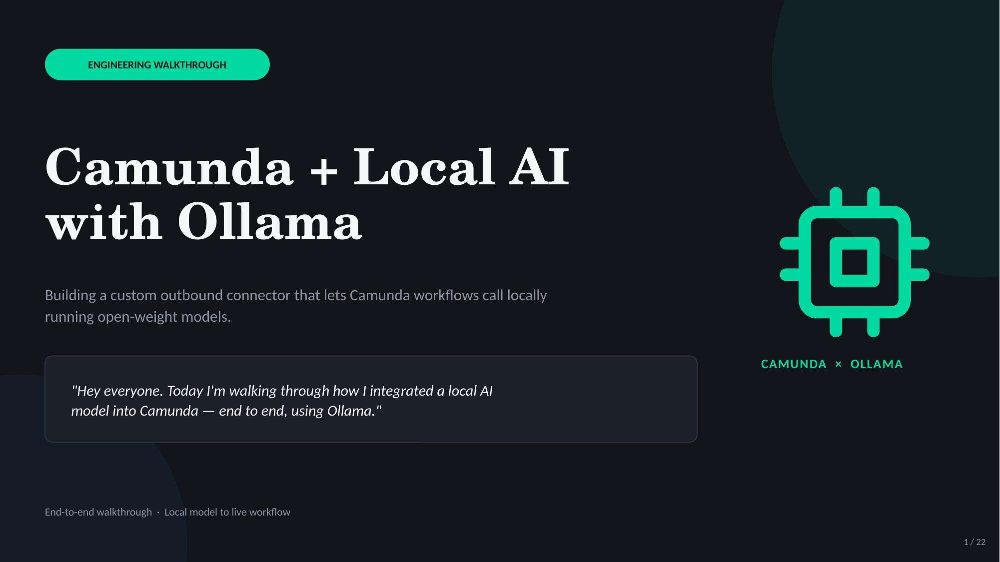
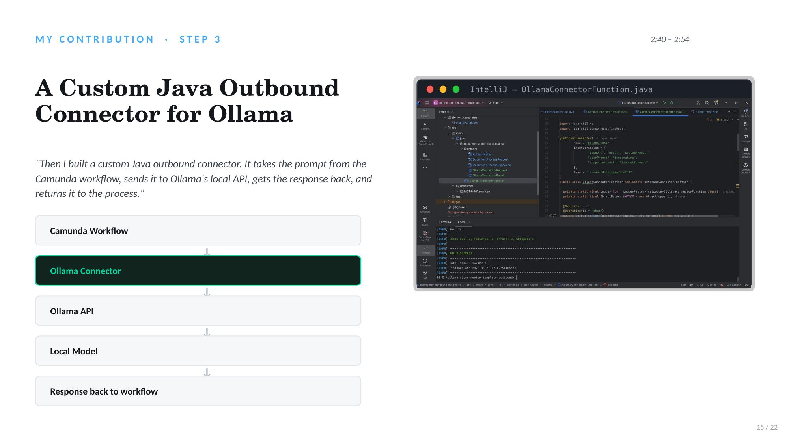
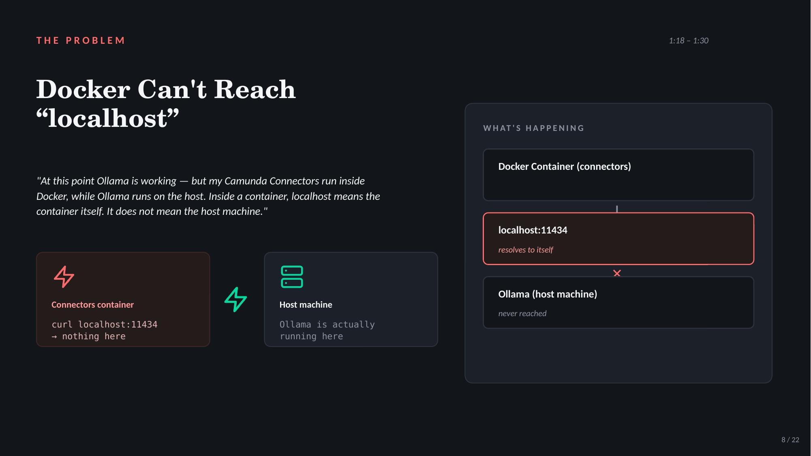
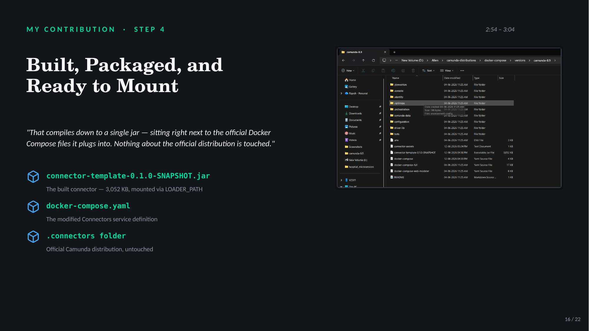
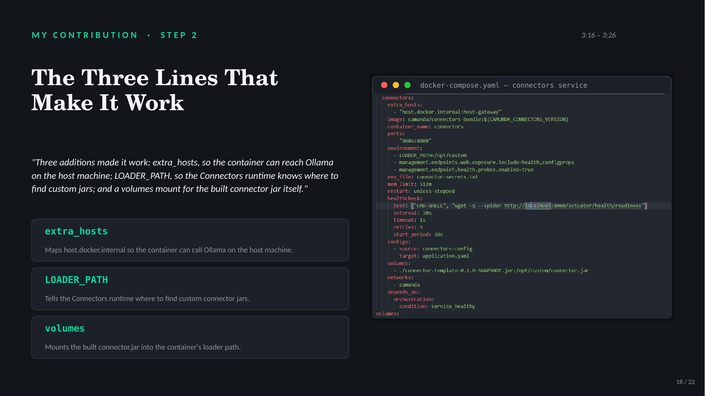
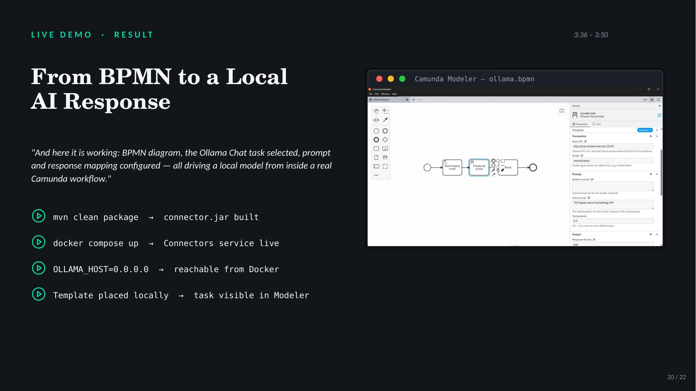
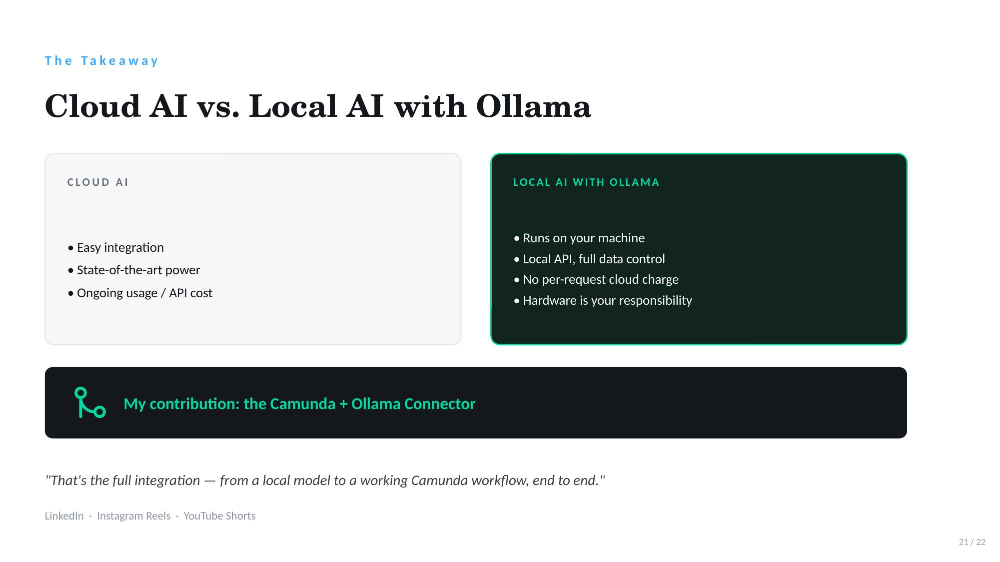
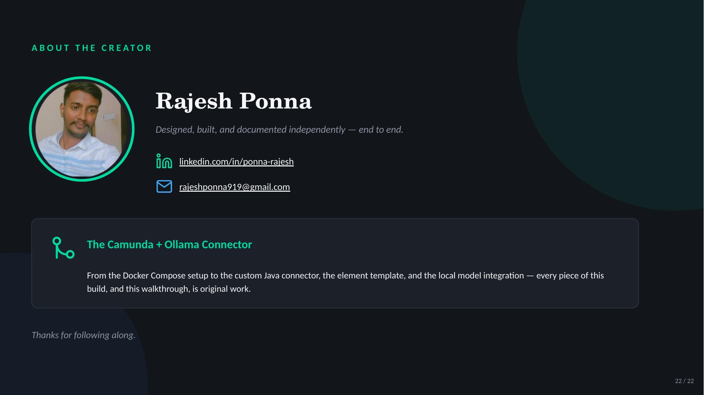

# Camunda + Local AI with Ollama

This connector has grown into the Unified Local AI Connector, which supports Ollama, vLLM, and any OpenAI-compatible engine from one Camunda 8 connector. New features and engines are added there. [Unified Local Ai Connector](https://github.com/rajeshponna/ollama-custom-connector).


A custom outbound connector that lets **Camunda 8 Self-Managed** workflows call **locally running, open-weight AI models** through **Ollama** — no cloud AI API, no per-request billing, full data control.




---

## Why

Cloud AI (OpenAI, Anthropic, etc.) bills per request. Inside a Camunda workflow that fires thousands of times, cost scales with volume, not value. For well-defined tasks, a smaller open-weight model running locally is often enough — and it costs nothing per call.

| | Cloud AI | Local AI with Ollama |
|---|---|---|
| Integration | Easy | Custom connector required |
| Model power | State-of-the-art | Match model size to task |
| Cost | Ongoing usage / API cost | No per-request charge |
| Data | Leaves your infrastructure | Stays on your machine |
| Hardware | Managed by provider | Your responsibility |

## What This Project Does

- Runs open-weight models (e.g. `llama3.2`, `mistral`, `qwen2.5`, `gpt-oss:20b`) locally via [Ollama](https://ollama.com), served through an OpenAI-compatible API (`http://localhost:11434/v1`)
- Ships a **custom Java outbound connector** that sends a prompt from a Camunda BPMN process to the local Ollama API and returns the response to the workflow
- Extends Camunda's official Self-Managed Docker Compose setup to bridge the container network to the host's Ollama instance
- Provides a Camunda Modeler **element template** (`Ollama Chat`) so the connector appears as a proper task type in BPMN diagrams

## Architecture

```
Camunda Workflow → Ollama Connector (Java) → Ollama API (host) → Local Model → Response → Workflow
```



Because Camunda Connectors run inside Docker while Ollama runs on the host, `localhost` inside the container resolves to the container itself, not the host machine.



This project solves that with:

1. `OLLAMA_HOST=0.0.0.0` — a systemd override so Ollama listens on all network interfaces, not just `127.0.0.1`
2. `extra_hosts` in `docker-compose.yaml` — maps `host.docker.internal` so the Connectors container can reach Ollama on the host
3. `LOADER_PATH` + a `volumes` mount — loads the custom connector `.jar` into the Connectors runtime without touching the official Camunda distribution

## Setup

**Prerequisites:** Docker, Docker Compose, Java/Maven, Camunda Desktop Modeler

1. **Install Ollama and pull a model**
   ```bash
   sudo apt-get update && sudo apt-get install zstd
   curl -fsSL https://ollama.com/install.sh | sh
   ollama pull mistral:latest
   ```

2. **Make Ollama reachable from Docker**
   ```bash
   sudo mkdir -p /etc/systemd/system/ollama.service.d
   sudo tee /etc/systemd/system/ollama.service.d/override.conf <<EOF
   [Service]
   Environment="OLLAMA_HOST=0.0.0.0"
   EOF
   sudo systemctl daemon-reload
   sudo systemctl restart ollama
   sudo ss -tlnp | grep 11434   # confirm it's bound to 0.0.0.0:11434
   ```

3. **Build the connector**
   ```bash
   mvn clean package
   ```
   Produces `connector-template-0.1.0-SNAPSHOT.jar`.

   

4. **Wire it into Docker Compose**

   In the Connectors service of `docker-compose.yaml`, add:
   ```yaml
   extra_hosts:
     - "host.docker.internal:host-gateway"
   environment:
     - LOADER_PATH=/opt/custom-connectors
   volumes:
     - ./connector-template-0.1.0-SNAPSHOT.jar:/opt/custom-connectors/connector.jar
   ```

   

5. **Start Camunda 8 Self-Managed**
   ```bash
   docker compose up -d
   ```
   Verify from inside the container:
   ```bash
   docker exec -it connectors sh -c "wget -T 5 -qO- http://host.docker.internal:11434/api/tags"
   ```

6. **Install the element template**

   Author the `Ollama Chat` element template as JSON (via Camunda SaaS Web Modeler or by hand), then copy it into:
   ```
   %APPDATA%\camunda-modeler\resources\element-templates\
   ```
   Restart Desktop Modeler — the "Ollama Chat" task type now appears in the palette.

7. **Deploy and run**

   Open the BPMN in Desktop Modeler, configure the Ollama Chat task (endpoint, model, prompt/output mapping), deploy, then start and test the process from Tasklist at `localhost:8080/tasklist`.

## Stack

- Camunda 8.9 Self-Managed (Orchestration + Connectors)
- Ollama (OpenAI-compatible local model server)
- Java (custom outbound connector)
- Docker / Docker Compose

## Status

Fully working end-to-end: BPMN → Ollama Chat task → local model → response back into the Camunda workflow.




